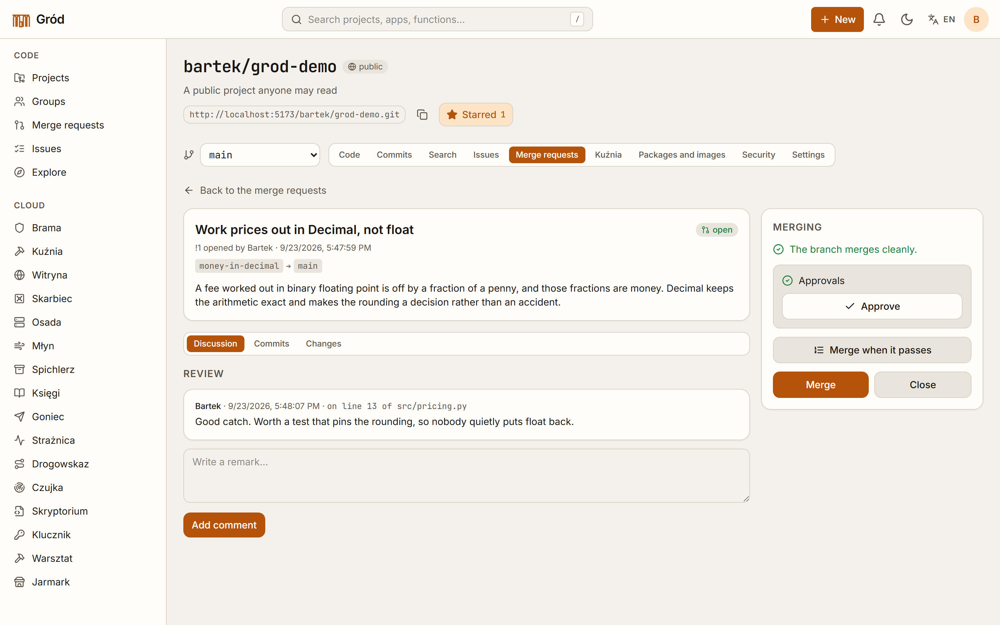
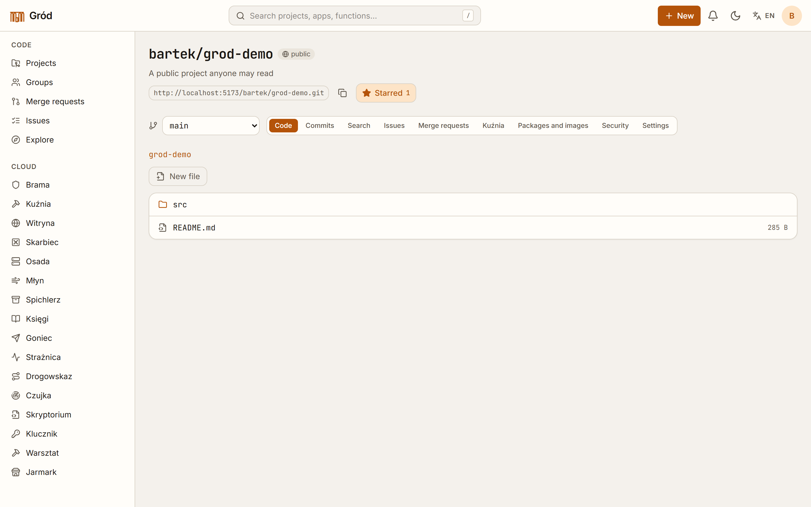
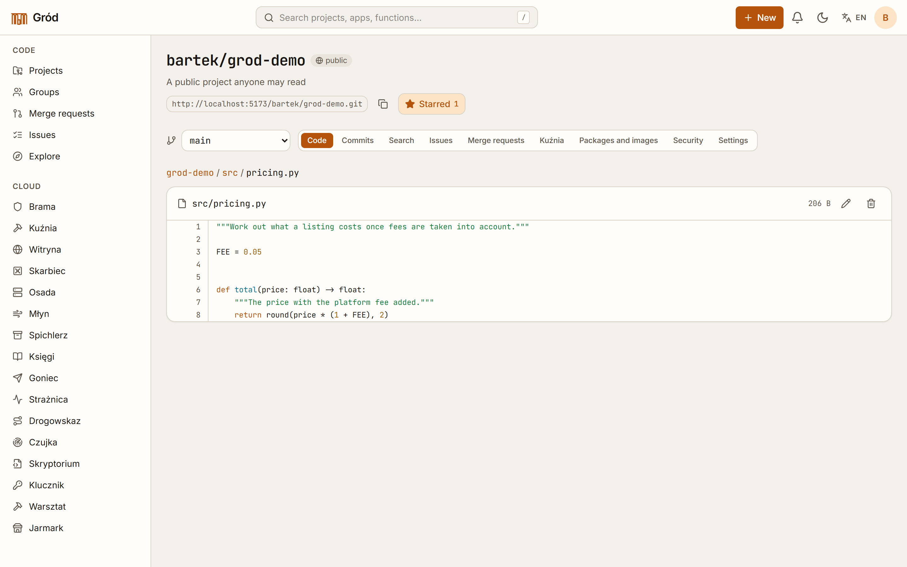
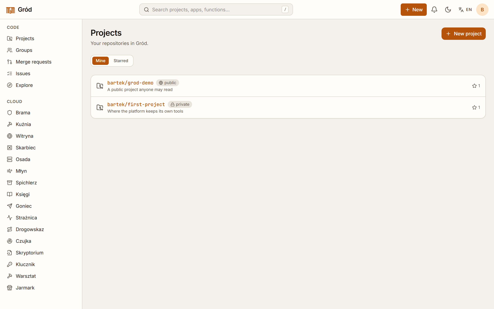
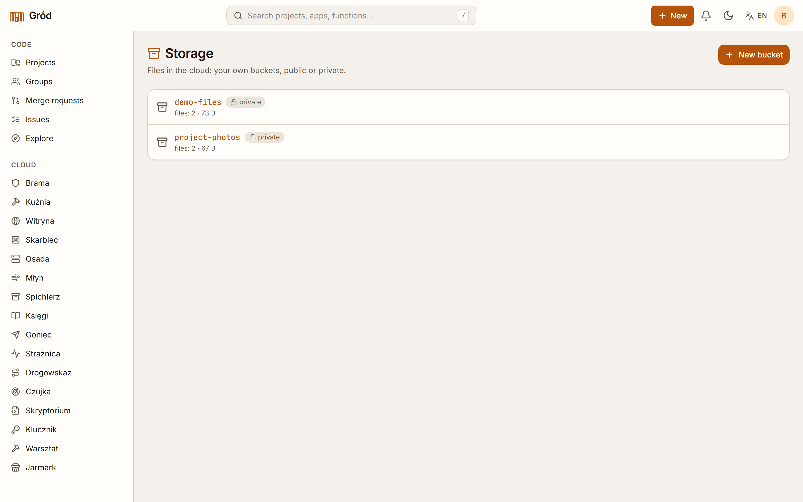
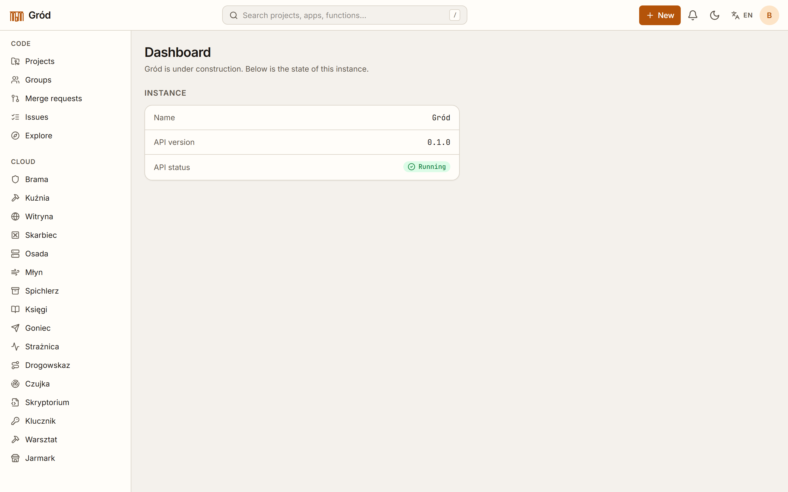

# Gród

[](https://github.com/Prymex6/grod/actions/workflows/ci.yml)
[](LICENSE)

A self-hosted software forge with a small cloud attached, written from scratch.

Git hosting over HTTPS and SSH, merge requests with a merge queue and path
owners, pipelines with their own runner, static site publishing, a container
registry — and next to it object storage, containerised applications,
on-demand functions, managed PostgreSQL databases, message queues, routing,
uptime checks and error reporting, all behind one account and one permission
model.

*Gród* is Polish for a fortified settlement. The modules are named after what
stands inside one — the gate, the forge, the granary, the treasury — which is
why the console says **Kuźnia** where the code says `ci`. The names live in the
translation files; the code is English throughout.



---

## Contents

- [What it does](#what-it-does)
- [Screenshots](#screenshots)
- [Running it](#running-it)
- [Working on it](#working-on-it)
- [How it is built](#how-it-is-built)
- [Testing and quality gates](#testing-and-quality-gates)
- [Layout](#layout)
- [Status](#status)

---

## What it does

### The forge

| | |
|---|---|
| **Repositories** | Git over HTTPS and SSH, both with real clients. Personal access tokens, account SSH keys, protected branches enforced by a `pre-receive` hook, file tree, history, blame-free diffs, `git grep` search, syntax highlighting, in-browser editing that commits. |
| **Merge requests** | Diff and commit list, review comments pinned to a line, members with roles, conflict detection before the merge. |
| **Merge queue** | Tests the *result* of the merge, not the branch, on a throwaway ref. If the target moved while the run was going, the entry goes back in line instead of merging something nobody tested. |
| **Approvals** | A count the project asks for, plus path owners read from `.grod/owners` or `CODEOWNERS` on the target branch. An approval goes stale when the source moves; nobody approves their own change. |
| **Review remarks** | Job logs are parsed for the `path:line:col: message` shape every linter already prints, and the remarks appear under the lines they are about. No report format, no plugin. |
| **Suggestions** | GitHub-style ```` ```suggestion ```` blocks, applied with one click as a commit on the source branch. |
| **Stacks** | A request whose target is another request's source *is* stacked on it — read off the branches, nothing to declare. Merging the bottom repoints the one above automatically, with no rebase and no invalidated approvals. |
| **Pipelines** | `.grod/ci.yml` with stages, jobs, variables and images; a standalone runner (`grod-runner`) that takes jobs over the API and streams its output back. |
| **Pages** | Any folder of a repository published as a static site. |
| **Registry & packages** | An OCI container registry speaking the Docker HTTP API (pushed and pulled with real tooling), plus generic package files and encrypted project secrets. |
| **Secret scanning** | Every push is read for credentials that should not be there — AWS keys, private keys, tokens the platform itself hands out. |
| **Workspaces** | A container holding the checked-out project and a terminal in the browser, with a button that turns the changes into a commit. |
| **Community** | Groups, public profiles, stars, an explore page, project templates. |

### The cloud

Object storage, applications run as containers, on-demand functions,
PostgreSQL databases created for real on the server, message queues, DNS-style
routing, uptime checks, error reporting and browsable API descriptions — each
with quotas per account and each reachable by machine identities.

### Accounts and access

Registration, password sign-in, TOTP two-factor, passkeys (WebAuthn),
password reset by email, sessions in an `HttpOnly` cookie, brute-force limits
— and a full **OpenID Connect provider**, so other applications can sign
people in through it: discovery document, JWKS, PKCE, a consent screen that is
remembered, refresh tokens that revocation actually kills.

On top of that sits an IAM module: grants over any resource of any module,
groups, and service accounts with their own tokens that see exactly what they
were granted and nothing their owner happens to have.

---

## Screenshots

The console is bilingual. These are taken with it set to English, which is
also how the module names sitting in the sidebar in Polish make sense: those
are proper nouns and stay as they are in both languages.

| | |
|---|---|
|  |  |
| Browsing a repository | Reading a file, coloured by language |
|  |  |
| The projects an account can reach | Object storage |
|  |  |
| Signing in, with a passkey as an option | The state of the instance |

---

## Running it

```bash
git clone <this repository>
cd grod
cp .env.example .env
docker compose up --build
```

- console — <http://localhost:8080>
- the mail it sends — <http://localhost:8025>
- Git over SSH — port 2222

Sign up on the console; the first account is an account like any other.

Two notes. Applications and workspaces run containers, so the API container
needs a Docker socket to use those two modules — everything else works
without one. And `GROD_PUBLIC_URL` is the OpenID Connect issuer, so it has to
match the address browsers actually type.

---

## Working on it

Backing services in containers, the two halves on the host:

```bash
docker compose -f infra/docker-compose.yml up -d   # PostgreSQL, Valkey, Mailpit

cd backend
uv sync
uv run alembic upgrade head
uv run uvicorn grod.main:app --port 8000

cd frontend
npm install
npm run dev                                        # http://localhost:5173
```

The console proxies the API in development, so both halves share an origin and
the session cookie needs no cross-origin handling.

A runner, if you want pipelines to actually run — register one in a project's
settings and start it with the token it gives you:

```bash
uv run grod-runner --url http://127.0.0.1:8000/api/v1 --token grodrun_...
```

---

## How it is built

**Backend** — Python 3.14, FastAPI, Pydantic, SQLAlchemy 2 (async), Alembic,
PostgreSQL 18, Valkey, `uv`.

**Frontend** — React 19, TypeScript in `strict` mode, Vite, Tailwind CSS v4,
react-router, i18next, xterm.js.

A few decisions worth naming:

- **`git` is called from exactly one module.** Nothing else in the codebase
  runs the binary, so the whole thing could later be swapped for an
  implementation of the protocol without touching anything above it. The same
  rule isolates Docker to one module and administrative SQL to another.
- **Nothing user-facing is written in the code.** Interface text lives in
  typed translation files — Polish by default, English beside it — and the
  keys are checked by the compiler.
- **Permissions are decided on the server, every time.** A shared scope
  helper answers "may this actor touch this row" for every cloud module, so a
  service account cannot quietly inherit what its owner can see.
- **Errors are explicit.** 146 refusals with their own message; nothing is
  swallowed.

---

## Testing and quality gates

Everything below has to pass before anything counts as done, and CI runs the
same commands on every push:

```bash
cd backend  && uv run ruff format --check . && uv run ruff check . && uv run mypy && uv run pytest
cd frontend && npm run check
```

- **302 backend tests.** Not mocks: they push over real `git`, serve real
  repositories, build real merge commits and create real databases.
- **104 frontend tests** with Vitest and Testing Library.
- **mypy in `strict` mode** over both `src` and `tests`.
- **ruff** with `ANN, B, C4, E, F, I, N, PT, RUF, S, SIM, UP, W`.
- **No `any`** anywhere in the TypeScript.

---

## Layout

```
backend/     the platform API and everything behind it (package `grod`)
  src/grod/  21 modules: accounts, repositories, collaboration, ci, pages,
             artifacts, scanning, workspaces, templates, iam, quotas,
             storage, apps, functions, databases, queues, routing,
             monitoring, errors, apidocs, community
  migrations/  34 Alembic revisions
  tests/       302 tests
frontend/    the web console (React), 26 routes, 104 tests, two languages
infra/       backing services for development
compose.yml  the whole platform in one command
```

---

## Status

Working and exercised in a browser, not only in tests. It is one person's
project, so treat it as a serious demonstration rather than something to put
in front of users tomorrow: there is no rate limiting on the public endpoints
yet, no backup story, and TLS is left to whatever sits in front of it.

What is deliberately absent is an AI assistant. Several of the features above
— review remarks, suggestions, the merge queue, stacks — are the parts of
commercial tools that turn out not to need a language model at all, and doing
them with ordinary engineering keeps the code on the machine it runs on.

Known gaps: applications and workspaces need a container engine on the host,
custom domains for routes and sites are not wired up yet, and there are no
end-to-end tests — the paths above are covered by the API tests instead.

---

## Licence

MIT — see [LICENSE](LICENSE).
